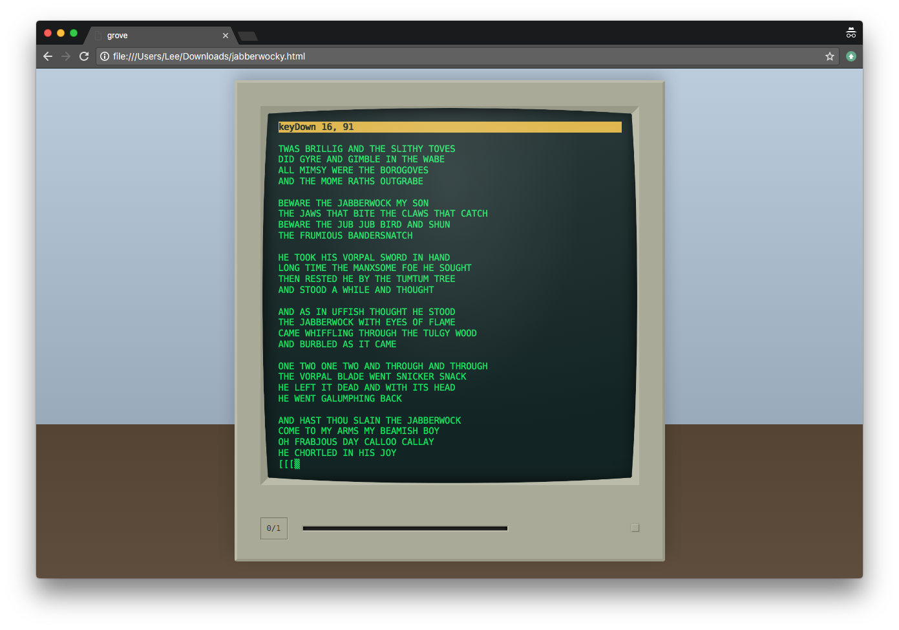

# The Grove Virtual PC

The **Grove** is a virtual personal computer that runs in a
web browser. You can write applications or operating systems
in JavaScript that run on a Grove.

The Grove can download snapshots of itself, allowing you to
save your work on your physical computer.

If you're unfamiliar with the concept of a virtual machine:
the Grove is a first-person video game in which your
character does nothing but interact with a computer.

## What's in the box?

This repository houses a general-purpose version of the
Grove computer that has no operating system or other
software installed. The intended audience is software
developers who want to write an operating system or other
software for the Grove.

## Building from Source

1. Clone or download this repo.
2. Be sure you have `node` and `npm` installed.
3. Run `./build.sh` in the repo folder. This will run the
   tests and create a `grove.html` file.
4. Open the created `grove.html` file in a web browser.

## User Guide

For more information on how to use a Grove, check out the
user guide at https://druidic.github.io/grove/guide.

## Version numbering system

The Grove uses two-part version numbers, of the form
`{release}.{patch}`. The motivation for this system over the
simpler alternative of numbering versions sequentially
(1, 2, 3, etc.) is perhaps best illustrated with an example.

Suppose the latest and greatest Grove version is 2.0. This
is the version you have installed. A few days after the
release of 2.0, we discover that it has a bug that only
appears on some browsers. We release version 2.1, which
fixes the bug. Soon after, we also release version 3.0,
which adds new features that didn't exist in 2.0. The
question you now face is: should you upgrade? And if so, to
what version?

That depends on whether you want the new features that 3.0
introduces. If you do, you can just upgrade to 3.0. But if
you don't, you can feel confident in upgrading to 2.1,
because that version only contains a bugfix and is otherwise
identical to 2.0.

In general, versions that only change the second part (the
patch number) are "safe to install". They will work with
the Grove software you currently have, and will make your
system faster and more stable. Versions that change
the first part (the release number) need to be treated with
more caution. They may drastically alter how the Grove
system works, so software that you currently use might not
run.

Note that the dot in a version number is just a divider, not
a decimal point, so versions 2.1 and 2.10 are different
(2.10 is the next patch version after 2.9, and is pronounced
"two-dot-ten").

What if you upgrade to the wrong version and want to go
back? Assuming you kept your old Grove snapshots around,
you can just reuse an earlier snapshot. Also, you can always
download old Grove versions from
https://github.com/druidic/grove/releases.

## Releasing

The below description of the release process applies only
to beta releases (version 0.X). Once version 1.0 is
released, the process will change.

1. Cut a branch from `master` named `release/0.X`, where
  `X` is the version number.
2. Bump the version number in version.js and commit it.
3. Tag the commit with the version number in the format
  `v0.X`.
4. `git push origin HEAD` and `git push --tags`.
5. Run `./build.sh` to generate `grove.html`.
6. Create a [Github release](https://github.com/druidic/grove/releases)
  and upload `grove.html`.
