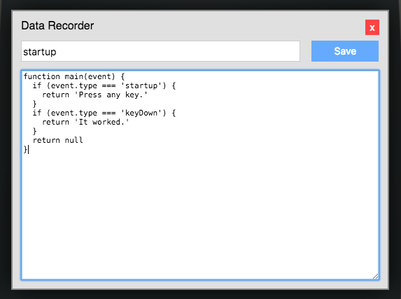

# Grove User Manual

development build

## Introduction

This file comprises the documentation for the Grove computer
system created and distributed by Druidic Technologies. By
reading and referring to it, you should be able to figure
out how to do just about anything that's possible to do with
your Grove system.

Though this manual aims to be comprehensive, it cannot be
exhaustive. For instance, the details of programming with
JavaScript have been glossed over, since extensive
JavaScript tutorials and documentation are available
elsewhere. When the manual must omit details like these, I
have provided references to other resources.

In preparing the manual, I have aimed for clarity, and,
where possible, brevity. If you find places where the manual
could be improved, please send feedback to

Ben Christel
the.wizard.ben@gmail.com

## Tutorial: Getting started

If you're reading this, you've already downloaded a Grove
and its accompanying documentation. What now?

### Opening the grove.html file

On many systems, you can double-click the `grove.html` file
you downloaded to open it in your favorite web browser. If
that doesn't work, open a browser (such as Firefox, Chrome,
or Safari) and select the `File > Open File...` menu. In
the dialog box that pops up, find the `grove.html` file and
open it.

### A tour of the Grove

Once you've opened the `grove.html` file, you'll be greeted
by the Grove's boxy virtual monitor and a message informing
you that the Grove doesn't yet have an operating system
installed. Ignore that message for now; before we install
anything, let's get familiar with the Grove's (virtual)
hardware.

#### The power button

The power button is located on the bottom left side of
the virtual computer case. Try clicking it; the virtual
monitor will blank out, indicating that the Grove has turned
off. Click the button again to turn the Grove back on.

#### The disk drive

Just to the right of the power button is the Grove's virtual
disk drive. It's reminiscent of floppy drives of old, and
serves a similar function. It allows you to save a copy of
your Grove system.

Click the disk drive slot. A file will download. If you open
that file in your browser, you'll see that it's a copy of
the Grove computer you already have open.

Since you haven't yet loaded any data into your brand-new
Grove, the save file is redundant. Feel free to move it to
the trash (or the equivalent on your system) to get rid of
it.

#### The display

The Grove has a monochrome character-grid display that can
render 32 lines of text with 64 characters per line.

### Renaming the Grove

Let's personalize your new Grove by loading some data into
it. We're going to give this computer a name.

Currently your computer has the default name "grove"—you
should see the name displayed somewhere near the top of your
browser window. Let's change it to something with a little
more flair.

Near the bottom-right corner of the Grove's case is a small,
unlabeled button that gives you access to the Grove's
internal data records. Click it, and a window will pop up.
In the narrow text field near the top, type `name`. In the
bigger text field, type a new name for your computer.

Click the "Save" button. Notice that the name in your
browser tab changes. Click the red "X" to close the Data
Recorder window.

Now click the disk drive slot again. This time, the
downloaded file has the name you just typed.

### Writing a program

Open the Data Recorder window again. In the bigger text
field, type (or paste) the code below. Either way, make sure
to enter it exactly as shown.

```javascript
function main(event) {
if (event.type === 'startup') return 'Press any key.'
if (event.type === 'keyDown') return 'It worked.'
return null
}
```

When you're done, it should look like this:



Click the "Save" button and close the window by clicking the
red `X` button at the top.

Now click the power button twice to turn the Grove off and
on again. You should see your program running—it will have
displayed "Press any key" on the screen. Press any key
and watch what happens.
